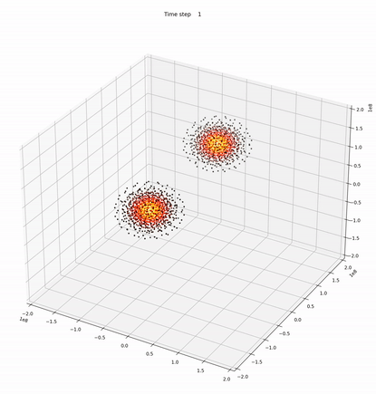

# Planetary Collision SPH 3D Simulation

Due to the chaotic nature of the differential equations that govern hydrodynamic interactions, it is some- times not possible to derive an analytic solution for them. These equations are very sensitive to the input parameters and will yield to totally different results even if the initial conditions are only changed by a small amount. It is for that, that scientists rely on numerical simulations to explore the possible outcomes from these equations for a given set of initial conditions.
There are two main types of frameworks to do the aforementioned simulations on: the Eulerian and the Lagrangian. Although both of them yield to the same (or very similar) results, they have several fundamental differences: while the Lagrangian approach follows every particle as they move along the simulation, the Eulerian approach focuses on observing only a specific patch of the simulation and the behavior of the particles that cross through it. Furthermore, Eulerian simulations are typically based on a grid that is fixed in space and time, which makes it complicated to apply it in certain situations. In this work, we will focus on a widely known method for a mesh-free Lagrangian method called smoothed particles hydrodynamics or SPH.

## Results from the simulation

